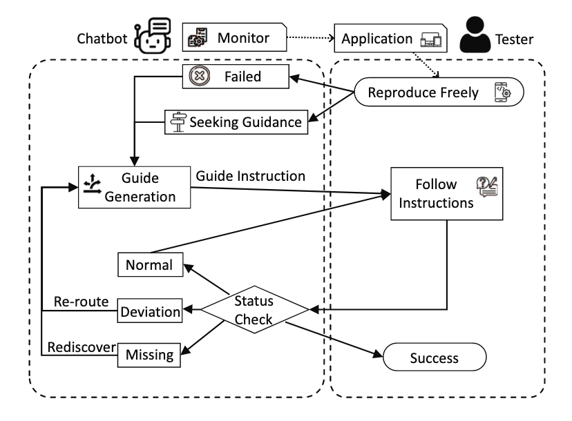
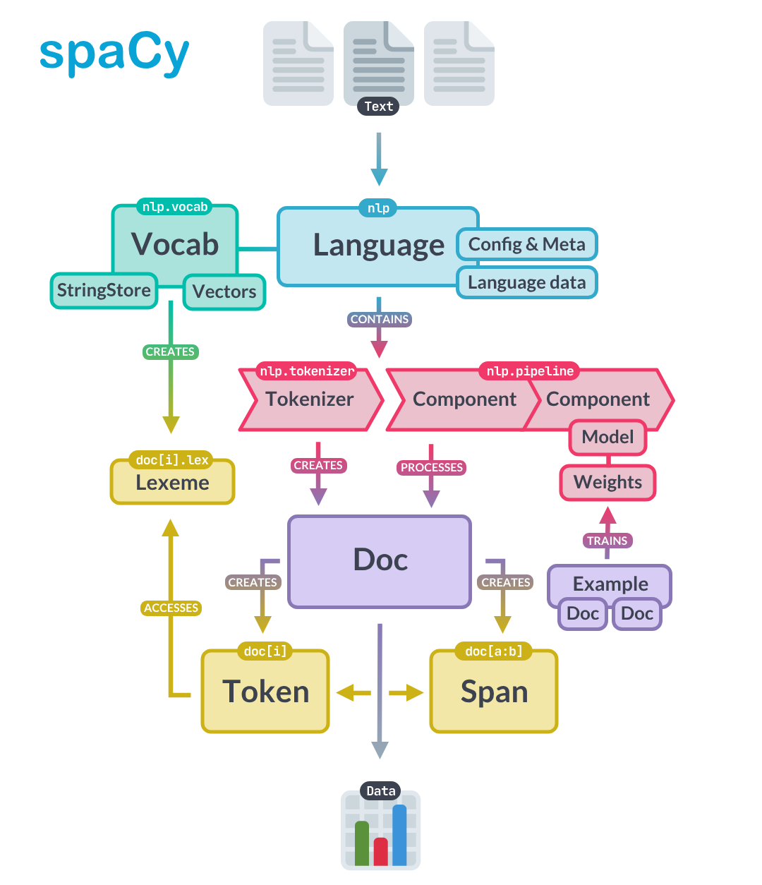

# GUI-bug-reproduction
A possible implementation of paper "[Towards Effective Bug Reproduction for Mobile Applications](https://ieeexplore.ieee.org/document/10314157)"

```bibtex
@inproceedings{liEffectiveBugReproduction2023,
  title = {Towards {{Effective Bug Reproduction}} for {{Mobile Applications}}},
  booktitle = {2023 10th {{International Conference}} on {{Dependable Systems}} and {{Their Applications}} ({{DSA}})},
  author = {Li, Xin and Yu, Shengcheng and Sun, Lifan and Liu, Yuexiao and Fang, Chunrong},
  year = {2023},
  month = aug,
  pages = {114--125},
  publisher = {{IEEE}},
  address = {{Tokyo, Japan}},
  doi = {10.1109/DSA59317.2023.00024},
  isbn = {9798350304770},
  langid = {english},
}
```

This project is based on a simple [Dialog System](https://en.wikipedia.org/wiki/Dialogue_system) to help testers reproduce bugs in mobile applications.


<div style="display: flex;flex-dirction: row; justify-content: center; zoom: 30%">


</div>


# DEMO

Here is a demo video [link](https://box.nju.edu.cn/f/cc3258c7c5fc4f60866b/)


# Quick Start

1. install all the dependencies

```shell
make install
```
2. config your appium server in `config.json`

3. run the project

```shell
make run
```

4. open your browser and visit <http:127.0.0.1:5000>

5. stop the project

```shell
make stop
```

# Project Structure
`data/` contains all the xml and png data fetched from the mobile application and all the prompt dialogues.

`model` contains all model files used to locate which state the tester is in.

`script/` contains all the scripts to run the project, including applium server.

`templates/` contains the chatbot frontend.

`test/` contains the test cases.

`static/` contains the static files, including css, js, images.

`app.py` is the main (backend) file to run the project.